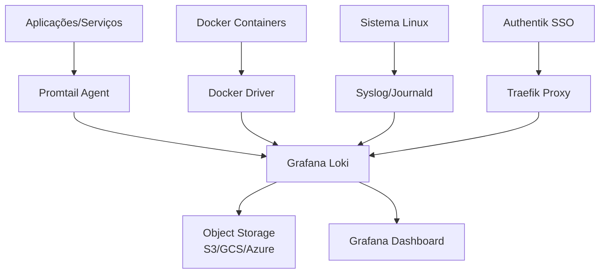

# Central Log Management com Grafana Loki - Guia Completo

> **Baseado no vídeo:** [Central Log Management for Docker + Linux // Grafana Loki](https://www.youtube.com/watch?v=KK9FI4OfPUY)  
> **Autor:** Christian Lempa

## 📋 Índice

1. [[#O que é Grafana Loki?]]
2. [[#Arquitetura e Visão Geral]]
3. [[#Pré-requisitos]]
4. [[Installation/01-Instalacao-Basica|Instalação Básica]]
5. [[Configuration/02-Configuracao-Inicial|Configuração Inicial]]
6. [[Docker-Logs/03-Docker-Logs|Configuração de Logs do Docker]]
7. [[Server-Logs/04-Server-Logs|Configuração de Logs do Servidor Linux]]
8. [[Security/05-Seguranca-Autenticacao|Segurança e Autenticação]]
9. [[#Análise de Logs]]
10. [[#Próximos Passos]]

---

## 🎯 O que é Grafana Loki?

**Grafana Loki** é um sistema de agregação de logs horizontalmente escalável, altamente disponível e multi-tenant, inspirado no Prometheus. Foi projetado para ser **muito eficiente em custos** e **fácil de operar**.

### ✨ Principais Características:

- **Não indexa o conteúdo dos logs** - apenas metadados (labels)
- **Compatível com Prometheus** - usa a mesma descoberta de serviços e labels
- **Integração nativa com Grafana** - visualização e alertas
- **Multi-tenant** - suporte para múltiplos usuários/organizações
- **Armazenamento eficiente** - compressão e armazenamento em chunks

### 🔄 Como Funciona:

1. **Coleta**: Agentes coletam logs de várias fontes
2. **Envio**: Logs são enviados para o Loki via HTTP API
3. **Armazenamento**: Logs são armazenados com labels para consulta
4. **Consulta**: Use LogQL (similar ao PromQL) para consultar logs
5. **Visualização**: Integração com Grafana para dashboards

---

## 🏗️ Arquitetura e Visão Geral



### 📦 Componentes Principais:

1. **Loki** - Servidor principal de logs
2. **Promtail** - Agente para coleta de logs
3. **Grafana** - Interface de visualização
4. **Object Storage** - Armazenamento de longo prazo (opcional)

---

## ⚙️ Pré-requisitos

### 🖥️ Sistema Operacional:
- **Linux** (Ubuntu 20.04+ recomendado)
- **Docker** e **Docker Compose** instalados
- **Mínimo 2GB RAM** e **10GB espaço em disco**

### 🔧 Ferramentas Necessárias:
```bash
# Verificar se Docker está instalado
docker --version
docker-compose --version

# Se não estiver instalado:
curl -fsSL https://get.docker.com -o get-docker.sh
sh get-docker.sh
sudo usermod -aG docker $USER
```

### 🌐 Rede e Portas:
- **Porta 3100** - Loki API
- **Porta 3000** - Grafana (se usado)
- **Porta 80/443** - Traefik (se usado)

### 📁 Estrutura de Diretórios:
```bash
mkdir -p ~/loki-stack/{config,data,logs}
cd ~/loki-stack
```

---

## 🚀 Links Úteis

### 📚 Documentação Oficial:
- [Grafana Loki Docs](https://grafana.com/docs/loki/latest/)
- [Boilerplates Repo](http://github.com/christianlempa/boilerplates)

### 🎥 Tutoriais Relacionados:
- [Grafana + Prometheus Tutorial](https://youtu.be/9TJx7QTrTyo?si=IzkCjQPdbWSCX0S7)
- [Traefik Tutorial](https://youtu.be/-hfejNXqOzA?si=EXRcGYYEvyXmDGmL)
- [Authentik Tutorial](https://youtu.be/N5unsATNpJk?si=IvnQV_FccJ23Ir2h)
- [Authentik Outpost Tutorial](https://youtu.be/_I3hUI1JQP4?si=Vv8wgP_wk9MkKgAG)

---

## ⏱️ Timeline do Vídeo

- **00:00** - Introdução
- **02:56** - O que é Grafana Loki?
- **05:15** - Visão Geral da Arquitetura
- **09:54** - Opções de Deployment
- **12:31** - Tutorial de Instalação
- **18:42** - Como analisar logs
- **22:33** - Enviar logs do Docker para Loki
- **28:57** - Autenticação HTTP básica
- **38:21** - Enviar logs do servidor para Loki
- **42:15** - Considerações finais e próximos passos

---

## 🎯 Próximos Passos

Após completar este guia, você terá:

✅ **Sistema de logs centralizado** funcionando  
✅ **Coleta automática** de logs do Docker e sistema  
✅ **Interface web** para consulta e análise  
✅ **Segurança básica** configurada  
✅ **Monitoramento** integrado com Grafana  

### 🔄 Melhorias Futuras:
- Configurar alertas baseados em logs
- Implementar retenção de logs automatizada
- Configurar backup e disaster recovery
- Integrar com sistemas de ticketing
- Configurar dashboards personalizados

---

*Guia criado baseado no vídeo de Christian Lempa sobre Central Log Management com Grafana Loki*

